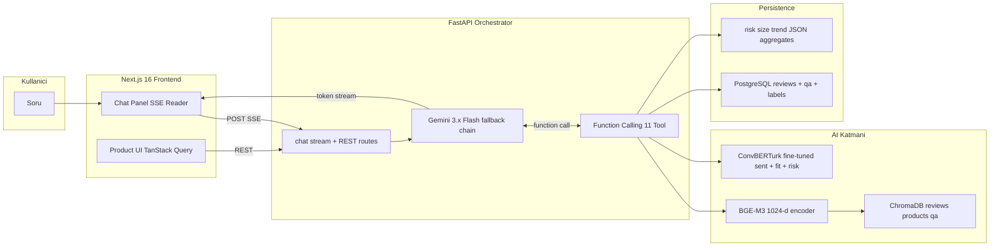

# Kanka — AI Alışveriş Asistanı

> Türk e-ticaret kullanıcısı için tek tıkla "uzman arkadaş" deneyimi. Yorumlardan kanıtlı cevaplar, kişisel beden tavsiyesi, multi-turn kombin önerisi ve satıcı tarafı AI içgörü paneli — hepsi tek üründe.

**BTK Akademi Hackathon 2026 · Tema: E-ticaret / Finans**

<p align="center">
  
  
  
  
  
  
  
  
  
</p>

---

## Niye?

Bir ürün sayfasında 1.000+ yorum var ama kimse okumuyor. Beden tablosu var ama "180 / 82'ye ne uyar" yazmıyor. Kombin önerisi var, ama gerçek katalogdan değil — sadece kuralla seçilmiş. **Kanka** bu 3 kara deliği tek bir akıllı asistanla doldurur:

| Soru | Klasik UX | Kanka |
| --- | --- | --- |
| "Bu tişört yazın terletir mi?" | 1.000 yorum scroll | Yorumlardan 3 kanıtla 2 cümlelik cevap |
| "180 / 82 hangi beden?" | Genel beden tablosu | "Senin profilinden 22 kişi L almış, %86 memnun" |
| "Bunla ne giyilir?" | Hand-curated kombin | Multi-turn agentic loop ile gerçek katalogdan 3-4 parça |
| "Bu üründe risk var mı?" | Yıldız ortalaması | BERT'in çıkardığı kumaş/beden/kargo şikayetlerinin bar chart'ı |

---

## Sistem Mimarisi

Tek bir LLM çağrısı yetmez. Her görev en uygun teknolojiye yönlendirilir.



### 4 Katmanlı AI Pipeline

#### 1. ConvBERTurk — Yorum Sınıflandırıcı (fine-tuned)
Single encoder, 3 head — multi-task learning:
- **Sentiment** (3 sınıf): positive / neutral / negative
- **Fit** (4 sınıf): tam / küçük / büyük / belirsiz
- **Risk** (5 etiket, multi-label): kumaş · renk · kalite · kargo · koku

Eğitim:
- **Faz 1 (warm-start)**: `fthbrmnby/turkish_product_reviews` (HF dataset, 235K) — sadece sentiment head, ilk 2 epoch.
- **Faz 2 (joint)**: Yerel Qwen3-8B (vLLM) ile structured JSON çıktısıyla 8.000 yorum zayıf etiketlendi → 3 head birlikte eğitildi, 3 epoch.
- **Doğrulama**: 300 örnek manuel altın set.
- **Çıktı**: tüm yorum kümesi batched inference ile etiketlendi (`reviews_labels.parquet`).

#### 2. BGE-M3 + ChromaDB — Semantic Retrieval
`BAAI/bge-m3` (1024-d, multilingual, Türkçe güçlü). 3 koleksiyon:

| Koleksiyon | İçerik | Metadata filtreleri |
| --- | --- | --- |
| `reviews_collection` | Ürün başına bilgilendirici yorumlar | `urun_slug · beden · boy_bin · kilo_bin · sent_label · fit_label · risk_top` |
| `products_collection` | Ürün özetleri | `slug · marka · kategori_son · cinsiyet · fiyat · rating · risk_level` |
| `qa_collection` | Müşteri Q&A | `urun_slug · satici · soru_tarihi` |

#### 3. Gemini 3.x Flash — Akıllı Orkestratör
Doğrudan cevap **üretmez** — yalnızca tool çağırır + tool çıktılarını sentezler.

**Fallback chain** (free tier 20 RPD limiti aşıldığında otomatik sıradakine geçer):
```
gemini-3.1-flash-lite → gemini-2.5-flash-lite → gemini-flash-lite-latest
→ gemini-3-flash-preview → gemini-2.0-flash-lite → gemini-2.5-flash
```
Cooldown sistemi her model için ayrı tutulur; demo sırasında kota tükenmez.

**11 Tool**:
```
search_reviews            · get_size_recommendation
search_products_by_intent · find_compatible_products
get_qa_answer_if_exists   · get_return_risk
get_seller_quality        · get_review_summary
get_size_distribution     · compare_products
get_alternative_product   · get_trending_for_category
```

#### 4. HDBSCAN — Kullanıcı Segmentasyonu (opsiyonel)
Yorum yapan kullanıcıları (boy, kilo, beden) 3-boyutta HDBSCAN'le 5-7 kümeye ayırır. Satıcı paneli için "profile-aware" beden dağılımı gösterir.

---

## Kullanıcı Akışı

```
┌─────────────────────────────────────────────────────────────┐
│  ÜRÜN DETAY SAYFASI                                          │
│  ┌─────────────┐ ┌─────────────────────────────────────────┐│
│  │             │ │  Marka · Ad · 4.6 · 1.084 yorum          ││
│  │   Gallery   │ │  2.156 TL  (eski 2.881 — %25 indirim)    ││
│  │   (sticky)  │ │  Renk · Beden seçici                     ││
│  │             │ │  Boy-kilonu gir, sana özel beden öner    ││
│  │             │ │  -> "180/80 -> L bedeni 22 kişi %86"     ││
│  │             │ │  [Sepete Ekle] [Kanka'ya Sor]            ││
│  └─────────────┘ └─────────────────────────────────────────┘│
│                                                              │
│  Açıklama | Özellikler | Yorumlar(1.084)                     │
│  AI 1-cümle özeti + bakım talimatları + filtre chip'leri     │
│                                                              │
│  Diğer Müşteriler Ne Sordu? (Q&A)                            │
│                                                              │
│  Sağ alt: Kanka chat panel                                   │
│     Akıllı status pill: "Üst için aday arıyorum…"            │
│     Cevap (markdown) + 3 ürün kartı + yorum kanıtı           │
└─────────────────────────────────────────────────────────────┘
```

### Admin / Satıcı modu

Header'daki **Kullanıcı ⇄ Admin** toggle ile:
- BERT'in çıkardığı sentiment + fit + risk rozetleri her yorumda görünür.
- İade Risk bar chart paneli açılır.
- Ürün sayfasında **AI İçgörü Kartı**: "Bu üründe son hafta kullanıcılar en çok 'uyumlu pantolon' önerisi sormuş — mağazana siyah kumaş pantolon ekleyebilirsin." gibi sentetik içgörüler.

---

## Demo Senaryoları

1. **Kanıt-temelli soru** → "Bu yazın terletir mi?" → `search_reviews` → 3 yorum kartı + 2 cümle özet
2. **Beden önerisi** → "182, 80 hangi beden?" → `get_size_recommendation` → "L bedeni 22 kişi almış, %86 memnun"
3. **Multi-turn kombin** → "Kombinleri Bul" → 3-4 tool turu (üst/alt/ayakkabı/aksesuar) → fotoğraflı ürün kartları
4. **Risk popover** → "İade riski %18 · Orta" rozetine tıkla → BERT'in dağılımı bar chart
5. **Satıcı içgörü** → Admin mode → ürün üzerinde 3 kartlık panel

---

## Teknoloji Yığını

**Frontend** — `Next.js 16` (App Router, Server Components) · `React 19` · `TypeScript strict` · `Tailwind v4` · `shadcn/ui` · `Motion` · `Zustand` (persist) · `TanStack Query` · `lucide-react`

**Backend** — `FastAPI` (async lifespan) · `Python 3.12` · `asyncpg` + `SQLAlchemy 2.0` · `ChromaDB 1.5` · `sentence-transformers` (BGE-M3) · `transformers` (ConvBERTurk fine-tune) · `Google Gen AI SDK` (Gemini) · `scikit-learn` · `HDBSCAN` · `pandas`

**Veri Pipeline** — ETL normalize → vLLM weak-labeling (Qwen3) → ConvBERTurk fine-tune → BERT inference → aggregate features → ChromaDB ingest → PostgreSQL ingest

**Servisler (docker-compose)** — `PostgreSQL 16` · `ChromaDB 1.5.9` (HTTP modu) · `chromadb-admin` (vektör tarayıcı UI)

---

## Veri Formatları

Bu repo eğitim verilerini içermez (data-collection ve `app/data/` git'lenmemiştir). `examples/` klasörü sistemde kullanılan dosya formatlarını sentetik bir kıyafet örneğiyle gösterir:

| Dosya | Format | Açıklama |
| --- | --- | --- |
| `examples/product.json` | Ürün şeması | UI'a yansıyan tam ürün objesi |
| `examples/reviews.jsonl` | JSONL | Ham yorum satırı (PostgreSQL & ChromaDB beslemesi) |
| `examples/bert_labels.jsonl` | JSONL | ConvBERTurk multi-task inference çıktısı |
| `examples/chroma_documents.json` | JSON | 3 koleksiyonun doküman + metadata yapısı |
| `examples/qwen_label_prompt.json` | JSON | Weak-supervision için Qwen3 prompt şablonu |

> Yukarıdaki örnek ürün ve yorumlar tamamen sentetiktir; herhangi bir gerçek marka, satıcı veya kullanıcıyla ilişkisi yoktur.

---

## Hızlı Başlangıç

### 0. Önkoşullar
- Python 3.12, Node 20+, Docker, Docker Compose
- Google Gemini API key (`GOOGLE_API_KEY`)

### 1. Backend
```bash
cd backend
docker-compose up -d postgres chroma chroma-admin
python -m venv ../.venv && source ../.venv/bin/activate
pip install -r requirements.txt
cp .env.example .env   # GOOGLE_API_KEY doldur
uvicorn app.main:app --port 8765 --host 0.0.0.0
```

### 2. Frontend
```bash
cd frontend
npm install
cp .env.example .env.local
npm run dev   # http://localhost:3000
```

### 3. Vektör veritabanını tarayıcıdan inceleme
- **Admin UI**: http://localhost:3500 → Connection: `http://chroma:8000`
- **Chroma HTTP API**: http://localhost:8001/api/v2/heartbeat

### 4. Veri pipeline (kendi verinizle eğitim)
```bash
cd backend
python scripts/etl_normalize.py       # raw -> parquet + products.json
python scripts/llm_label_qwen.py      # weak supervision
python scripts/train_berturk.py       # ConvBERTurk fine-tune
python scripts/infer_berturk.py       # tüm yorumlara label
python scripts/aggregate_features.py  # risk / size / trend
python scripts/ingest_chroma.py       # vektör DB
python scripts/ingest_postgres.py     # ilişkisel DB
```

---

## Proje Yapısı

```
.
├── backend/
│   ├── app/
│   │   ├── ai/             # gemini, retrieval, berturk, tools, vllm_client
│   │   ├── routes/         # FastAPI: products, reviews, qa, cart, chat, ...
│   │   ├── schemas.py      # Pydantic — frontend tipleriyle birebir
│   │   ├── db.py           # asyncpg + SQLAlchemy 2.0
│   │   └── main.py         # lifespan: BGE-M3 + ConvBERTurk + Chroma eager-load
│   ├── scripts/            # ETL · labeling · training · inference · ingestion
│   └── docker-compose.yml  # postgres + chroma + chroma-admin
├── frontend/
│   ├── app/                # Next.js App Router (urun, cart, kategori, ...)
│   ├── components/         # product, cart, chat, home, shared
│   ├── store/              # Zustand: cart, chat, admin
│   └── lib/                # api client, queries, types
├── examples/               # sentetik veri formatları (eğitim/UI/vector)
└── docs/                   # mimari + entegrasyon notları
```

---

## Lisans

Hackathon kapsamında MIT.
